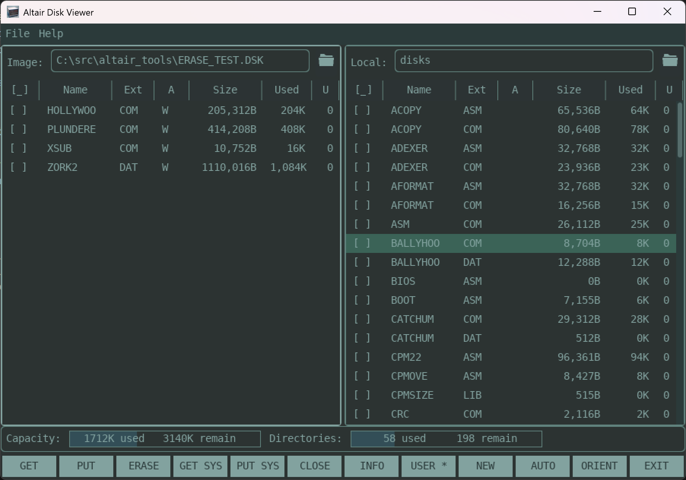

# Altair Tools 

A collection of utilities for the Altair 8800

* Altairdsk allows the reading and writing of 8"  Altair 8800 floppy disk disk images.
* Adgui provides a graphical user interface for most altairdsk operations.
* *New:* Altairdisk now supports all formats shipped with the Altair-Duino, including support for CP/M, Altair DOS, Altair BASIC, Cromemco CDOS, Timeshare BASIC and Hard Disk BASIC.

If you are looking for a utility similar to CP/M tools, but for the Altair 8800 floppy disk images, then this repository is for you. 
It has been tested under Windows and Linux, and known to work under MacOS.

altairdsk allows you to:
  1. Perform a directory listing
  2. Copy files to and from the disk
  3. Erase files
  4. Format an existing disk or create a newly formatted disk.
  5. Create bootable disk images
  6. Read and modify disk image labels (CDOS and HD Basic)
  7. Translate encoded Altair / MS Basic files to ASCII.
  8. Recover disk images with directory entry corruption.

_Note: If you prefer the C version, you can find that under the "legacy" branch. I don't provide support for this version anymore._

## Example usage ##
[Go to the gui examples](docs/ADGUI.md)<br>
[Go to the command line examples](#command-line)

| | | | |
|---|---|---|---|
| [Get a directory listing](#get-a-directory-listing) | [Format a disk](#format-a-disk) | [Set a disk label](#set-a-disk-label) | [View a disk label](#view-a-disk-label) |
| [Copy a file from the disk (get)](#copy-a-file-from-the-disk-get) | [Copy a file to the disk (put)](#copy-a-file-to-the-disk-put) | [Copy multiple files from the disk (get multiple)](#copy-multiple-files-from-the-disk-get-multiple) | [Copy multiple files to the disk image (put multiple)](#copy-multiple-files-to-the-disk-image-put-multiple) |
| [Erase a file](#erase-a-file) | [Erase multiple files](#erase-multiple-files) | [Save system tracks from bootable disk](#save-system-tracks-from-bootable-disk) | [Make a bootable disk from previously saved system tracks](#make-a-bootable-disk-from-previously-saved-system-tracks) |
| [Fixup Altair Duino 5MB HDSK images](#fixup-altair-duino-5mb-hdsk-images) | [Image Information](#image-information) | [Raw directory listing](#raw-directory-listing) | |

## LLM Disclosure and Contribution Policy
* All Zig code and documentation in this repository is human crafted.
* No LLMs have been used to write any lines of code or documentation.
* LLMs have been used in a read-only capacity for code review, and format debugging.
* LLMs have also been used for writing throw-away investigation tools.
* Code and documentation contributions must not contain any LLM content or be directly derived from LLM content.
* All bugs and issues are also human crafted.

## Supported Disk Image Types


| Type              | Format                          | Operating System   | Support Level |
|-------------------|---------------------------------|--------------------|---------------|
| FDD_8IN (default) | MITS 8" Floppy Disk             | CP/M                | Full |
| ADOS_8IN          | MITS 8" Floppy Disk             | Altair DOS & BASIC | Full |
| TIMESHARE_BASIC   | MITS 8" Floppy Disk             | Timeshare BASIC    | Read Only |
| ADOS_MINI         | MITS 5.25" Data Floppy Disk     | Altair DOS & BASIC | Full |
| ADOS_MINI_BOOT    | MITS 5.25" Bootable Floppy Disk | Altair DOS & BASIC | Full |
| CPM_MINI          | MITS 5.25" Floppy Disk          | CP/M                | Full |
| HDD_5MB           | MITS 5MB Hard Disk              | CP/M                | Full |
| HDD_5MB_1024      | MITS 5MB, with 1024 directories(1) | CP/M             | Full |
| HD_BASIC          | MITS 5MB Hard Disk              | Altair HD BASIC    | Full |
| FDD_TAR           | Tarbell Floppy Disk             | CP/M                | Full |
| FDD_1.5MB         | FDC+ 1.5MB Floppy Disk          | CP/M                | Full |
| FDD_8IN_8MB       | FDC+ 8MB "Floppy" Disk          | CP/M                | Full |
| CDOS_SMSSSD       | CROMEMCO 5.25" SS SD Disk       | CDOS               | Full |
| CDOS_SMSSDD       | CROMEMCO 5.25" SS DD Disk       | CDOS               | Full |
| CDOS_SMDSSD       | CROMEMCO 5.25" DS SD Disk       | CDOS               | Full |
| CDOS_SMDSDD       | CROMEMCO 5.25" DS DD Disk       | CDOS               | Full |
| CDOS_LGSSSD       | CROMEMCO 8" SSSD Disk           | CDOS               | Full |
| CDOS_LGSSDD       | CROMEMCO 8" SSDD Disk           | CDOS               | Full |
| CDOS_LGDSSD       | CROMEMCO 8" DSSD Disk           | CDOS               | Full |
| CDOS_LGDSDD       | CROMEMCO 8" DSDD Disk           | CDOS               | Full |

(1) Note you need the modified CP/M image to use this format. See https://github.com/ratboy666/hd1024                           

***While every care has been taken to ensure this utility will not corrupt your disk images, _PLEASE_ make sure you make a backup of any disk images before writing to them.***

## Releases

Binaries are provided on the Release page for the following architectures:

| OS      | Arch    | cmdline | GUI  |
|:--------|:--------|:-------:|:----:|
| Windows | x86_64  | ✅ | ✅ |
| Linux   | x86_64  | ✅ | ✅ |
| MacOS   | x86_64  | ✅ | ❌ |
| Windows | aarch64 | ✅ | ✅ |
| Linux   | aarch64 | ✅ | ✅ |
| MacOS   | aarch64 | ✅ | ❌ |
| Linux   | arm     | ✅ | ❌ |

If you want to use the gui on one of the other platforms, you will need to build from source. 

## Building from Source

This version of altair tools is built using Zig. Zig aims to be a more modern version of C, without all the complications of kitchen-sink languages, like C++ and Rust.
The C version can be found in the legacy directory and should still build using cmake, but will no longer be supported or developed by me.

One of the nice things about Zig is that the build system is part of the language making building from source relatively simple. However, Zig is still a young language and many things change from release to release. So please make sure you use the correct Zig verison to build the project.

1. Install Zig version 0.16.0 from https://ziglang.org/ or from your package manager if available.
2. zig build --release=safe

Optionally build the GUI.
1. cd adgui
2. zig build --release=safe

The executables are placed in the respective zig-out\bin directories.
There is no install target provided. So copy the executable to your desired install location if you need.

**Note:** Zig is good at filling up your disk with cache files (Eating GBs of space). After you are done building, clear out:
1) The global cache: run `zig env` and look for the `.global_cache_dir` variable,
2) Local cache: .zig-cache directory,
3) Local packahe: zig-pkg directory.

This is especially bad with zig 0.16.0 as there is a bug with "lazy" dependencies, which causes every dependency of every dependency to be downloaded, no matter if that dependency is actually used or not. There are some cache improvements planned, so hoping it is resolved soon.

## GUI

The Altair Disk GUI (adgui) provides access to most of the functionality of the altaridsk tool. The application can be operated entirely by keyboard
if desired.  [Keyboard shortcuts and general instructions for using the GUI](docs/ADGUI.md).

### Altair Disk GUI



## Command Line
```
altairdsk
Version: 0.9.5

USAGE:
  altairdsk [OPTIONS] <disk_image> [<filename>...]

Altair Disk Image Utility

ARGUMENTS:
  disk_image   Filename of Altair disk image
  filename     List of filesnames. Wildcards * and ? are supported e.g. '*.COM'

OPTIONS:
  -d, --dir                         Directory listing (default)
  -r, --raw                         Raw directory listing
  -i, --info                        Prints disk format information
  -F, --format                      Format existing or create new disk image. Defaults to FDD_8IN
  -g, --get                         Copy file from Altair disk image to host
  -o, --out <outdir>                Out directory for get and get multiple
  -G, --get-multiple                Copy multiple files from Altair disk image to host. Wildcards * and ? are supported e.g '*.COM'
  -p, --put                         Copy file from host to Altair disk image
  -P, --put-multiple                Copy multiple files from host to Altair disk image
  -e, --erase                       Erase a file
  -E, --erase-multiple              Erase multiple files - wildcards supported
  -t, --text                        Put or get a file in text mode
  -b, --bin                         Put or get a file in binary mode  (CP/M and ADOS Only)
  -n, --random                      Put or get a random access file (Altair DOS/BASIC only)
  -a, --basic                       Put or get a Altair BASIC file as ASCII (Altair DOS/BASIC and HD_BASIC only)
  -u, --user <user>                 Restrict operation to this user (CP/M and CDOS)
  -x, --extract-os <system_image>   Extract operating system (from a bootable disk image) to a file
  -s, --write-os <system_image>     Write saved operating system image to disk image (make disk bootable)
  -R, --recover <new_disk_image>    Try to recover a corrupt image
  -T, --type <type>                 Disk image type. Auto-detected if possible. Supported types are:
                                          * FDD_8IN - MITS 8" Floppy Disk (CPM) [Default]
                                          * ADOS_8IN - MITS 8" Floppy Disk (Altair DOS & BASIC)
                                          * TIMESHARE_BASIC - MITS 8" Floppy Disk (Timeshare BASIC) [READ ONLY]
                                          * ADOS_MINI - MITS 5.25" Data Floppy Disk (Altair DOS & BASIC)
                                          * ADOS_MINI_BOOT - MITS 5.25" Bootable Floppy Disk (Altair DOS & BASIC)
                                          * CPM_MINI - MITS 5.25" Floppy Disk (CPM)
                                          * HDD_5MB - MITS 5MB Hard Disk (CPM)
                                          * HDD_5MB_1024 - MITS 5MB, with 1024 directories (CPM)
                                          * HD_BASIC - MITS 5MB Hard Disk (Altair HD BASIC)
                                          * FDD_TAR - Tarbell Floppy Disk (CPM)
                                          * FDD_1.5MB - FDC+ 1.5MB Floppy Disk (CPM)
                                          * FDD_8IN_8MB - FDC+ 8MB "Floppy" Disk (CPM)
                                          * CDOS_SMSSSD - CROMEMCO 5.25" SS SD Disk (CDOS)
                                          * CDOS_SMSSDD - CROMEMCO 5.25" SS DD Disk (CDOS)
                                          * CDOS_SMDSSD - CROMEMCO 5.25" DS SD Disk (CDOS)
                                          * CDOS_SMDSDD - CROMEMCO 5.25" DS DD Disk (CDOS)
                                          * CDOS_LGSSSD - CROMEMCO 8" SSSD Disk (CDOS)
                                          * CDOS_LGSSDD - CROMEMCO 8" SSDD Disk (CDOS)
                                          * CDOS_LGDSSD - CROMEMCO 8" DSSD Disk (CDOS)
                                          * CDOS_LGDSDD - CROMEMCO 8" DSDD Disk (CDOS)
                                    !!! The HDD_5MB_1024 type cannot be auto-detected. Always use -T with this format.
  -q, --quiet                       Suppress non-fatal error, warning and info messages
  -v, --verbose                     Prints information about operations being performed
  -V, --very-verbose                Additionally prints sector read/write information
  -L, --label-set <label>           Set the disk label and timestamp on CDOS and HD BASIC disks. Format <label>:mm/dd/yy
  -l, --label                       Print the disk label and timestamp from CDOS or HD BASIC disks
  -f, --force                       Force overwrite of existing files with get or put
  -h, --help                        Show this help output
      --color <VALUE>               When to use colors (*auto*, never, always).
```

## Some things to note:
* If an invalid filename for the disk format is supplied, for example ABC.COMMMMMM on CP/M, it will be converted to a similar valid  filename; ABC.COM in this example.
* If the disk contains an invalid format for the host operating system, the invalid characters with be URL-encoded. e.g. \*FILE\* translates to %2AFILE%2A on Windows.
* The 5MB HDD images that come with the Altair-Duino have an invalid directory table. altairdsk will print an error and refuse to open these images. Use the -R / --recover option to create a clean version of these disk images.
* Wildcard expansion is now performed on windows. 
* Wildcards don't work the same as on CP/M. ./altairdsk xxx.dsk -G '\*' will match everything, including the extension, and get all files. On CP/M you would use '\*.\*'. You can still use '\*.TXT' and 'ABC.\*' and that will work as expected.
* As mentioned in the usage, if using the HDD_5MB_1024 format with 1024 directory entries, make sure you always use the -T option. You *will* corrupt the image if you don't specify the format.

| Operating system | Notes |
|---|---|
| CP/M | For text files it is important to use <code>--text</code> when copying from image.Otherwise the files will be padded with ^Z to the next 128 byte multiple.<br>Supports <code>--user</code> |
| Altair DOS and BASIC | Use <code>--random</code> when copying random access files to a disk image<br>BASIC files are extracted in encoded form by default:<ul><li>Copying from image: use <code>--basic</code> to convert to plain text</li><li>Copying to image: use <code>--basic</code> for plain text BASIC files.<br>(otherwise the first character is dropped on load)</li></ul> |
| Timeshare Basic | As per Altair BASIC, but read-only. |
| Altair HD BASIC | BASIC files are extracted in encoded form by default:<ul><li>Copying from image: use <code>--basic</code> to convert to plain text</li><li>Copying to image: use <code>--basic</code> for plain text BASIC files<br>(otherwise the first character is dropped on load)</li></ul>Supports disk labels.<ul><li>Use <code>--label</code> to view disk label.</li><li>Use <code>--label-set</code> to set disk label.</li><li><code>--label-set</code> can be used with <code>--format</code></li></ul>The creation date contained in the disk label is used as the creation and modification time of any file created by altairdsk. |
| Cromemco DOS (CDOS) | Supports disk labels.<ul><li>Use <code>--label</code> to view disk label.</li><li>Use <code>--label-set</code> to set disk label.</li><li><code>--label-set</code> can be used with <code>--format</code></li></ul>Supports <code>--user</code><br>Non-standard directory counts are not supported. The image will fail to open with an InvalidFormat error. |
| | |

## Examples

### Get a directory listing
`./altairdsk -d CPM.dsk`<br>
`./altairdsk CPM.dsk`<br>
Restrict the directory listing to a particular user with the -u option<br>
`./altairdsk -u 0 CPM.dsk`

```
Name     Ext  Length Used U At
ASM      COM   8768B   8K 0 W
DDT      COM   5206B   6K 0 W
DO       COM   2329B   4K 0 W
DUMP     COM    411B   2K 0 W
ED       COM   6576B   6K 0 W
FORMAT   COM   1918B   2K 0 W
L80      COM  11508B  12K 0 W
LADDER   COM  43155B  40K 0 W
LOAD     COM   2192B   2K 0 W
LS       COM   3288B   4K 0 W
M80      COM  21509B  20K 0 W
MAC      COM  12604B  12K 0 W
NSWP     COM  12056B  12K 0 W
PIP      COM   7946B   8K 0 W
R        COM   4384B   4K 0 W
STAT     COM   5754B   6K 0 W
TEST     COM    137B   2K 0 W
W        COM   4247B   4K 0 W
WM       COM  11371B  12K 0 W
XDIR     COM  11782B  12K 0 W
20 file(s), occupying 178K of 296K total capacity
41 directory entries and 118K bytes remain
```
Length is length of the file to nearest 128 byte sector<br>
Used is the amount of space actually used on the disk (in multiples of 1 block)<br>
U is the user number<br>
At is the file attributes which vary per operating system.
| Operating System | First | Second | 
|------------------|-------|--------|
| CP/M / CDOS       | R - Read Only<br>W - Read / Write | S - System |
| Altair DOS & BASIC<br>Timeshare BASIC | S - Sequential<br> R - Random Access | | 
| HD BASIC         |  R - Read Only<br>W - Read / Write | S - Small File<br>L - Large File |

Below is an example for HD BASIC showing the disk label and file dates.<br>
Filenames are up to 24 characters long, with no file extension.

```
Label: DISK LABEL  Created: 01/02/73  Modified: 01/02/73
Name                       Length  Used U At Created  Modified
*COPRND*                    5888B    6K 0 WS 10/23/78 11/06/78
*HDCDATA                    9511B   10K 0 WS 10/18/78 10/18/78
*INSTR                      4625B    6K 0 WS 10/18/78 10/18/78
COP-HF                      4579B    6K 0 WS 10/23/78 10/23/78
DIRLIST                     2052B    4K 0 WS 10/18/78 10/18/78
FILECOPY                    6656B    8K 0 WS 10/23/78 10/23/78
HDCOPY                       821B    2K 0 WS 00/00/00 00/00/00
HELP                         293B    2K 0 WS 11/06/78 11/06/78
HELP.TXT                    6788B    8K 0 WS 10/23/78 10/23/78
ISAM-T16                    6170B    8K 0 WS 11/06/78 11/06/78
ISAM-TWO                    6148B    8K 0 WS 11/07/78 11/07/78
STARTREK                    5425B    6K 0 WS 10/18/78 10/18/78
VOLINIT                    10290B   12K 0 WS 07/20/79 07/20/79
13 file(s), occupying 86K of 4694K total capacity
497 directory entries and 4608K bytes remain
```

### Format a disk
`./altairdsk -F new.dsk`<br>
To format for a specific type<br>
`./altairdsk -F -T HDD_5MB new.dsk`<br>
To add a label (if supported)<br>
`./altairdsk.exe -F fmt.dsk -T CDOS_LGSSSD -L "disk 01:12/31/79"`

You can generally put options in any order<br>
`./altairdsk new.dsk -F -T HDD_5MB`<br>
`./altairdsk -F new.dsk -T FDD_TAR`

### Set a disk label
Label format is \<label\>:mm/dd/yy<br>
`HDSK01.DSK --label-set "DISK LABEL:01/02/73"`<br>
Can be combined with --format (-F)<br>
`./altairdsk -F -T HD_BASIC new.dsk -L ABC:05/06/77`

### View a disk label
`altairdsk.exe  fmt.dsk -l`
```
Label: disk 01 
Date:  12/31/79 (mm/dd/yy)
```

### Copy a file from the disk (get)
`./altairdsk -g CPM.dsk LADDER.COM`

get files for a single user<br>
`./altairdsk -g -u1 CPM.dsk LADDER.COM`

### Copy a file to the disk (put)<br>
`./altairdsk -p CPM.dsk LADDER.COM`

### Copy multiple files from the disk (get multiple)
This command allows wildcards of * or ?. Note the use of single quotes to stop the shell/command prompt expanding wildcards<br>
`./altairdsk -G CPM.dsk load.com dump.com 'asm.*' 'p?p.com'`

To get all files from the disk<br>
`./altairdsk -G CPM.dsk '*'`

If the same file exists for multiple users, the user number is appended to the filename e.g. ASM.TXT_1.

### Copy multiple files to the disk image (put multiple)
`./altairdsk -P CPM.dsk load.com dump.com asm.com pip.com`

Copy multiple files to user 1<br>
`./altairdsk -P -u1 CPM.dsk *.com`

### Erase a file
`./altairdsk -e CPM.dsk asm.com`

If the same file exists for multiple users, only the first copy of the file will be erased. Use the -E option to erase the file for all users.

### Erase multiple files
`./altairdsk -E CPM.dsk 'asm.*'`

If the same file exists for multiple users, the -E option will remove the file from all users, unless the -u option is specified.<br>
To remove all files from user 2<br>
`./altairdsk -E -u 2 CPM.dsk '*'`

### Save system tracks from bootable disk
`./altairdsk -x CPM.dsk boot.img`

### Make a bootable disk from previously saved system tracks
`./altairdsk -s CPM.dsk boot.img`

### Fixup Altair Duino 5MB HDSK images
The CP/M HDSK03.DSK and HDSK04.DSK images that come with the Altair Duino have some directory entry corruption. 

This version of altairdsk includes a -R / --recovery option to create a new version of the image. Please be careful with the order you specify the options or you can accidentally overwrite the original image. The new image name must be specified immediately after the -R option. *Always keep a backup before doing any write operations*<br>
`altairdsk -R HDSDK04_NEW.DSK HDSK04.DSK`

You will see a list of errors while running this command. These are expected.

### Image Information
Displays track and sector information.
`./altairdsk -i CPM.dsk`
```
Type:         HDD_5MB
Sector Len:   128
Data Len:     128
Num Tracks:   406
Res Tracks:   1
Secs / Track: 96
Block Size:   4096
Track Len:    12288
Recs / Ext:   256
Recs / Alloc: 32
Dirs / Sect   4
Dirs / Alloc: 16
Dir Allocs:   2
Num Dirs:     256
```

### Raw directory listing
Dumps the raw directory information<br>
#### CP/M
`./altairdsk -r CPM.dsk`
```
IDX:U:FILENAME:TYP:AT:EXT:REC:[ALLOCATIONS]
000:0:ASM     :COM:W :000:064:[2,3,4,5,0,0,0,0,0,0,0,0,0,0,0,0]
001:0:DDT     :COM:W :000:038:[6,7,8,0,0,0,0,0,0,0,0,0,0,0,0,0]
002:0:DO      :COM:W :000:017:[9,10,0,0,0,0,0,0,0,0,0,0,0,0,0,0]
003:0:DUMP    :COM:W :000:003:[11,0,0,0,0,0,0,0,0,0,0,0,0,0,0,0]
004:0:ED      :COM:W :000:048:[12,13,14,0,0,0,0,0,0,0,0,0,0,0,0,0]
005:0:FORMAT  :COM:W :000:014:[15,0,0,0,0,0,0,0,0,0,0,0,0,0,0,0]
006:0:L80     :COM:W :000:084:[16,17,18,19,20,21,0,0,0,0,0,0,0,0,0,0]
007:0:LADDER  :COM:W :000:128:[22,23,24,25,26,27,28,29,0,0,0,0,0,0,0,0]
008:0:LADDER  :COM:W :001:128:[30,31,32,33,34,35,36,37,0,0,0,0,0,0,0,0]
009:0:LADDER  :COM:W :002:059:[38,39,40,41,0,0,0,0,0,0,0,0,0,0,0,0]
010:0:LOAD    :COM:W :000:016:[42,0,0,0,0,0,0,0,0,0,0,0,0,0,0,0]
011:0:LS      :COM:W :000:024:[43,44,0,0,0,0,0,0,0,0,0,0,0,0,0,0]
012:0:M80     :COM:W :000:128:[45,46,47,48,49,50,51,52,0,0,0,0,0,0,0,0]
013:0:M80     :COM:W :001:029:[53,54,0,0,0,0,0,0,0,0,0,0,0,0,0,0]
014:0:MAC     :COM:W :000:092:[55,56,57,58,59,60,0,0,0,0,0,0,0,0,0,0]
015:0:NSWP    :COM:W :000:088:[61,62,63,64,65,66,0,0,0,0,0,0,0,0,0,0]
016:0:PIP     :COM:W :000:058:[67,68,69,70,0,0,0,0,0,0,0,0,0,0,0,0]
017:0:R       :COM:W :000:032:[71,72,0,0,0,0,0,0,0,0,0,0,0,0,0,0]
018:0:STAT    :COM:W :000:042:[73,74,75,0,0,0,0,0,0,0,0,0,0,0,0,0]
019:0:TEST    :COM:W :000:001:[76,0,0,0,0,0,0,0,0,0,0,0,0,0,0,0]
020:0:W       :COM:W :000:031:[77,78,0,0,0,0,0,0,0,0,0,0,0,0,0,0]
021:0:WM      :COM:W :000:083:[79,80,81,82,83,84,0,0,0,0,0,0,0,0,0,0]
022:0:XDIR    :COM:W :000:086:[85,86,87,88,89,90,0,0,0,0,0,0,0,0,0,0]
FREE ALLOCATIONS:
091 092 093 094 095 096 097 098 099 100 101 102 103 104 105 106
107 108 109 110 111 112 113 114 115 116 117 118 119 120 121 122
123 124 125 126 127 128 129 130 131 132 133 134 135 136 137 138
139 140 141 142 143 144 145 146 147 148 149
```
|Field|Description| 
|-----|-----------| 
|IDX | The order of the extent on disk |
|U | The user number |
|AT | The attributes (R - Read only, W - Read/Write, S - System) |
|EXT | The extent number for the file |
|REC | The number of records controlled by this directory entry |
|ALLOCATIONS | The list of allocations controlled by this directory entry |

#### Altair DOS & BASIC
```
FNR:FILENAME:MD:TK:SC
001:#F80    :02:47:00
002:FORLBREL:02:43:18
003:#M80    :02:3d:08
004:#L80    :02:3b:08
005:#CREF80 :02:39:00
008:#COP    :02:38:08
012:&SYSENT :02:33:08
013:&ASK    :02:34:18
014:&AANS   :02:34:10
015:&CMPB   :02:34:08
016:&COP    :02:36:00
017:&TABLE  :02:37:10
018:#EDIT   :02:27:00
019:&MOVB   :02:37:08
021:&LDEM   :02:37:00
022:&DTYP   :02:38:18
023:&DN     :02:38:10
024:&ECHO   :02:29:08
025:&PRIME  :02:2b:18
026:#LPT    :02:39:18
027:#DEBUG  :02:4c:08
028:#LINK   :02:4b:18
029:#ASM    :02:4a:10
030:#PRIME  :02:33:18
032:#LIBMRG :02:2a:10
034:#INIT   :02:31:08
035:#ECHO   :02:4a:08
FREE DIRECTORIES: (228)
FREE ALLOCATIONS: (167)
000 001 002 003 004 005 006 007 008 009 010 011 012 013 014 015 
etc...
```
|Field|Description| 
|-----|-----------| 
| FNR | The file number which is the same as the directory index + 1 |
| MD | The Mode. 02 for Sequential files, 04 for random access files |
| TK:SK | The first data track and sector for this file. |

#### HD BASIC
```
IDX:FILENAME                :CREATE:MODIFY:R:S:NRPGS:LPEOF:NRGPS:LSTGP:[ALLOCATIONS]
001:VOLUME TABLE            :3173a3:023201:1:1:00003:00000:00001:00000:[0000]
002:DIRECTORY TABLE         :3173a3:023201:1:1:00256:00000:00032:00055:[0024, 0025, 0026, 0027, 0028, 0029, 0030, 0031, 0032, 0033, 0034, 0035, 0036, 0037, 0038, 0039, 0040, 0041, 0042, 0043, 0044, 0045, 0046, 0047, 0048, 0049, 0050, 0051, 0052, 0053, 0054, 0055]
003:*COPRND*                :4e0a17:4e0b06:3:1:00023:00000:00003:00058:[0056, 0057, 0058]
004:*HDCDATA                :4e0a12:4e0a12:3:1:00037:00039:00005:00067:[0063, 0064, 0065, 0066, 0067]
005:*INSTR                  :4e0a12:4e0a12:3:1:00018:00017:00003:00070:[0068, 0069, 0070]
006:COP-HF                  :4e0a17:4e0a17:3:1:00017:00227:00003:00075:[0071, 0074, 0075]
007:DIRLIST                 :4e0a12:4e0a12:3:1:00008:00004:00002:00073:[0072, 0073]
008:FILECOPY                :4e0a17:4e0a17:3:1:00026:00000:00004:00062:[0059, 0060, 0061, 0062]
009:HDCOPY                  :000000:000000:3:1:00003:00053:00001:00078:[0078]
010:HELP                    :4e0b06:4e0b06:3:1:00001:00037:00001:00079:[0079]
011:HELP.TXT                :4e0a17:4e0a17:3:1:00026:00132:00004:00097:[0080, 0081, 0082, 0097]
012:STARTREK                :4e0a12:4e0a12:3:1:00021:00049:00003:00085:[0083, 0084, 0085]
013:VOLINIT                 :4f0714:4f0714:3:1:00040:00050:00006:00091:[0086, 0087, 0088, 0089, 0090, 0091]
014:ISAM-TWO                :4e0b07:4e0b07:3:1:00024:00004:00004:00098:[0076, 0077, 0092, 0098]
015:ISAM-T16                :4e0b06:4e0b06:3:1:00024:00026:00004:00096:[0093, 0094, 0095, 0096]
FREE DIRECTORIES: (497)
FREE ALLOCATIONS: (2304)
099 100 101 102 103 104 105 106 107 108 109 110 111 112 113 114 
etc ...
```
|Field|Description| 
|-----|-----------| 
| IDX | The index of the directory entry + 1 |
| CREATE | Encoded created time |
| MODIFY | Encoded modification time  |
| R | 1 = Read Only, 3 = Read / Write |
| S | File status. 1 for a small file, 3 or a large file. Anything else means deleted. |
| NRPGS | The number of pages (sectors) this file takes up |
| LPEOF | How many bytes of the last page are used for file data |
| NRGPS | The number of groups/blocks allocated to this file |
| LSTGP | The last group/block number |
| ALLOCATIONS | The groups allocated to each file. For large files, this points to one or more blocks  containing the actual file allocations. |
