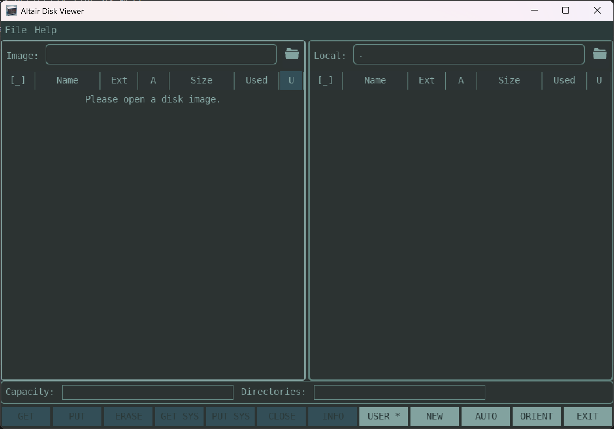
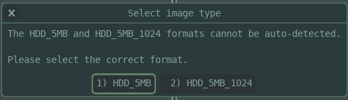
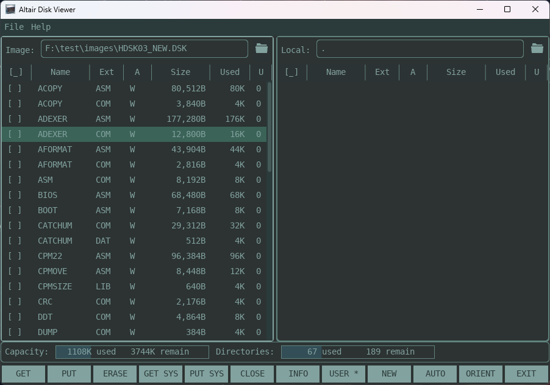
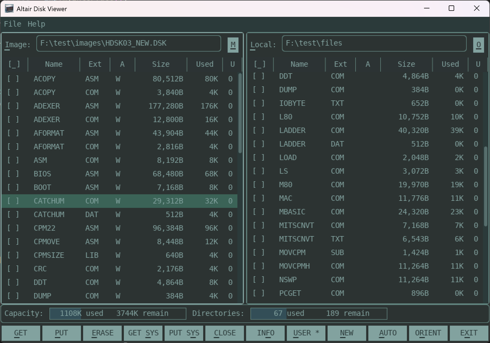
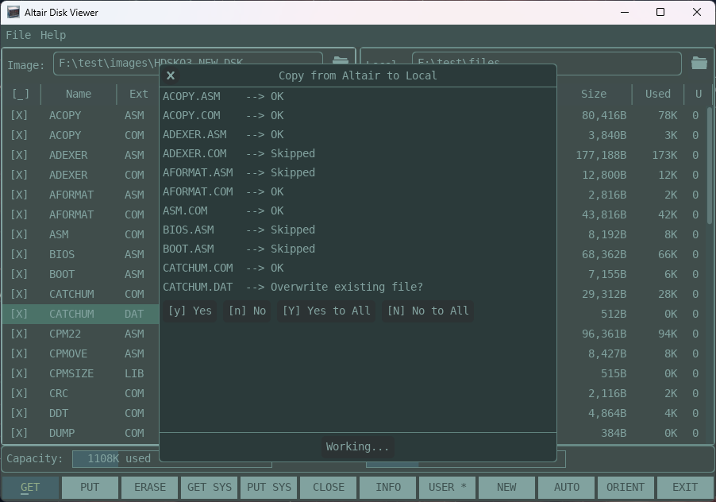
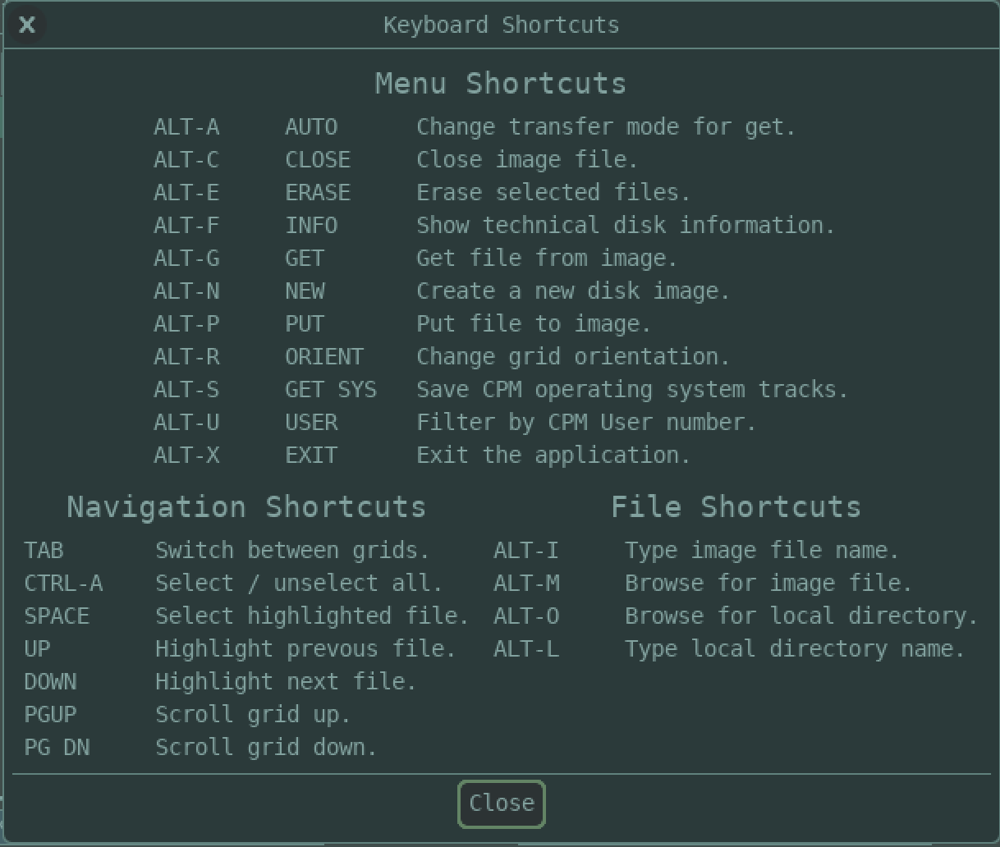

# Altair Disk GUI (ADGUI)

Adgui gives you most of the functionality of the command line tool, just with a flashier interface.
The GUI is designed to be operated solely by keyboard, which is how I mostly use it. But of course, mouse
interaction works perfectly fine as well.

When you start adgui you are greeted with the following screen:

The left grid displays the contents of the disk image, while the right grid displays the contents of the local directory.

Let's open up a new image. You can use Alt-M or click on the folder icon to bring up a file browser, Alt-I to jump to the Image text entry box to type in the directory name.

If you open a 5MB HDD image, you will see the following warning:

Unless you have patched your CPM kernel to use the 1024 directory entry version, just select the standard HDD_5MB option. But *be warned*, selecting the wrong option can corrupt your disk image, so please keep a backup, just in case.

If you hold down the ALT key, you will see the keyboard shortcuts for the whole screen. You can also use the Help->Shortcuts menu to see more information on the shortcuts and what each command does.

Here we use Ctrl-A to select all of the files in the image and then Alt-G (Get) to copy all of the files from the image to the local directory.

An example of copying files is shown below:

## Some other things you might find useful

1) Sorting, by clicking on the grid column headers
2) There is a splitter between the grids so you can resize each grid. You can completely hide the local directory if you just want to see the altair files.
3) You can drag files from the operating system and drop them into the application. SDL does not currently support dragging files out of the application, so it is one-way fucntionality for now.
4) The Orient (Orientation) button is broken in this build. I'll fix it before the final release.

## Keyboard Shortcuts

